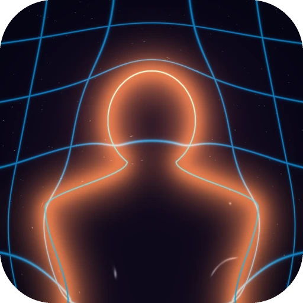

# GravyLensing



[](https://willjroper.github.io/GravyLensing/)
[](https://github.com/WillJRoper/gravy-lensing/actions/workflows/release-macos.yml)
[](https://github.com/WillJRoper/GravyLensing/releases/latest)
[](LICENSE)
[](https://github.com/WillJRoper/GravyLensing/releases)

GravyLensing is a real-time gravitational-lensing demo written in C++ and developed with support from the Goodwood Festival of Speed Future Lab.

It uses a live camera feed to identify a projected mass distribution, either a person or an object of a chosen colour, then applies an FFT-based deflection calculation to lens a background image around it.

> **Requires an Apple Silicon Mac (M1 or newer) running macOS 14 or later.**

## Example

An example running in debug mode to show the camera feed, the person mask, the background, and the final lensed output.


## Install

Download the latest signed DMG from
[GitHub Releases](https://github.com/WillJRoper/GravyLensing/releases), drag
**GravyLensing** to **Applications**, and open it. No Homebrew or command-line
setup is required.

### Build from source

Developers can build locally with Homebrew:

```bash
brew install cmake fftw libomp opencv qt
cmake -B build \
  -DCMAKE_PREFIX_PATH="/opt/homebrew/opt/qtbase;/opt/homebrew/opt/libomp" \
  -DCMAKE_BUILD_TYPE=Release
cmake --build build --config Release
```

This produces `build/GravyLensing.app`.

## Documentation

**[willjroper.github.io/GravyLensing](https://willjroper.github.io/GravyLensing/)**

- [Installation](https://willjroper.github.io/GravyLensing/getting_started/installation.html)
  and [quick start](https://willjroper.github.io/GravyLensing/getting_started/quickstart.html)
- [Ways to run the demo](https://willjroper.github.io/GravyLensing/running_modes.html)
  — mirror mode and telescope mode, and how to choose
- [Functionality](https://willjroper.github.io/GravyLensing/usage/index.html) —
  lens modes, masking, the lens itself, backgrounds, shortcuts, and CLI flags
- [Running a good demo](https://willjroper.github.io/GravyLensing/recommendations.html)
  — setting up a real space
- [FAQ](https://willjroper.github.io/GravyLensing/faq.html)

The sources live in [`docs/`](docs). Build them locally with:

```bash
pip install -r docs/requirements.txt
make -C docs html
```

## Contributing

Contributions, issues, and feature requests are welcome. Fork the repository
and open a pull request.

## License

GNU GPL-3.0. See [LICENSE](LICENSE) for details.
