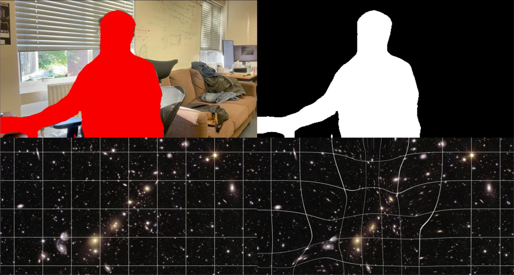

GravyLensing
^^^^^^^^^^^^

GravyLensing is a real-time gravitational lensing demo. It takes a live camera
feed, works out where the "mass" is in each frame — a person, or an object of a
chosen colour — and uses an FFT-based deflection calculation to lens a
background image around it, at camera frame rate.

It was built for public engagement and outreach, with support from the Goodwood
Festival of Speed Future Lab. The physics is the real thing: the mask acts as a
projected mass distribution, and the background image is deflected the way a
distant galaxy is deflected by a foreground cluster.

New here? Start with :doc:`getting_started/installation`, then
:doc:`getting_started/quickstart`. Before running the demo in front of an
audience, read :doc:`running_modes` — the choice between mirror mode and
telescope mode shapes everything else — and :doc:`recommendations`.

Contents
^^^^^^^^

.. toctree::
   :maxdepth: 2

   getting_started/installation
   getting_started/quickstart
   running_modes
   usage/index
   recommendations
   faq

Contributing
------------

Contributions, issues, and feature requests are welcome. Fork the
`repository <https://github.com/WillJRoper/gravy-lensing>`_ and open a pull
request.

License
-------

GravyLensing is free software made available under the GNU General Public
License v3.0. See
`LICENSE <https://github.com/WillJRoper/gravy-lensing/blob/main/LICENSE>`_ for
details.
